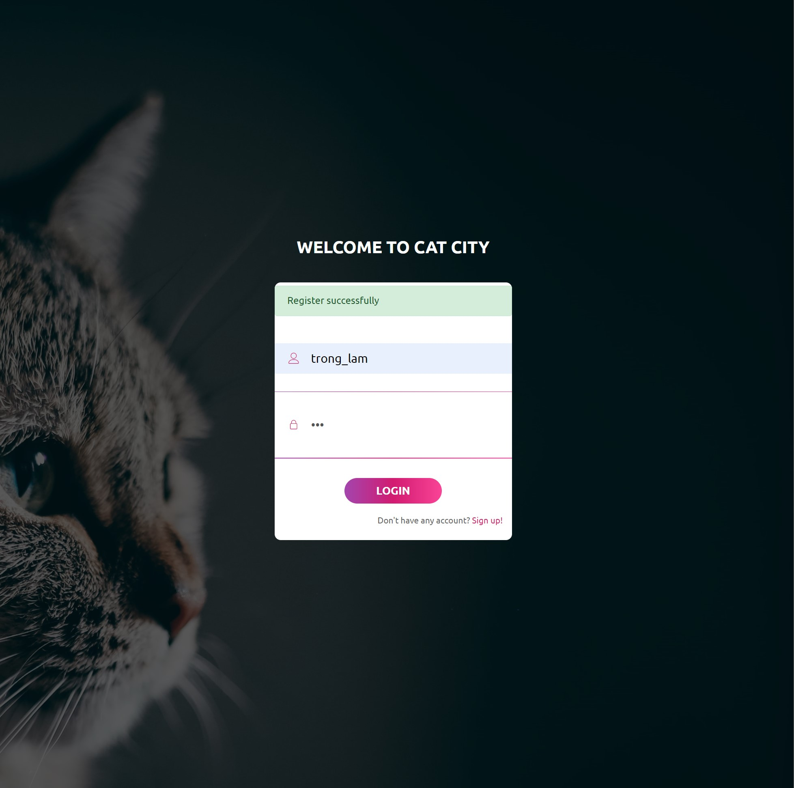
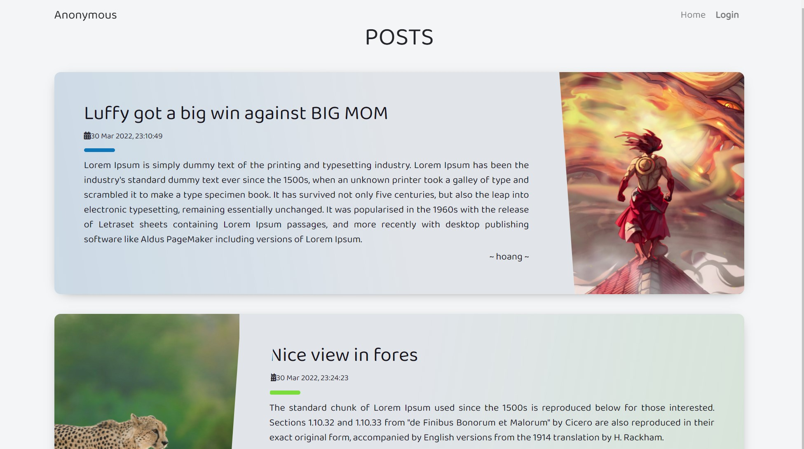
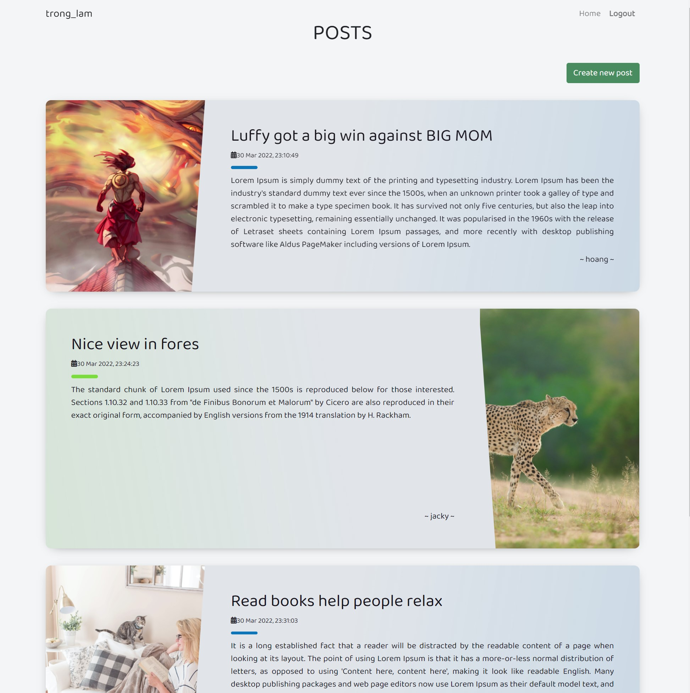
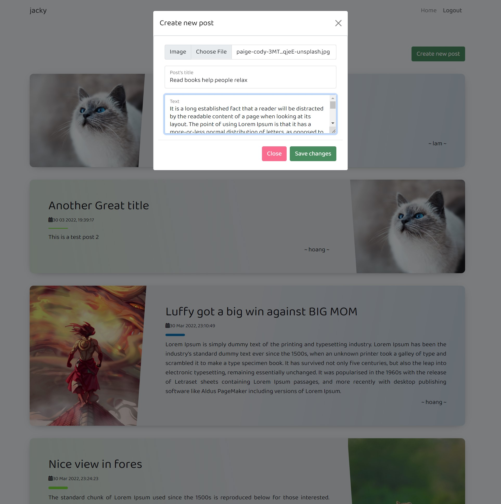
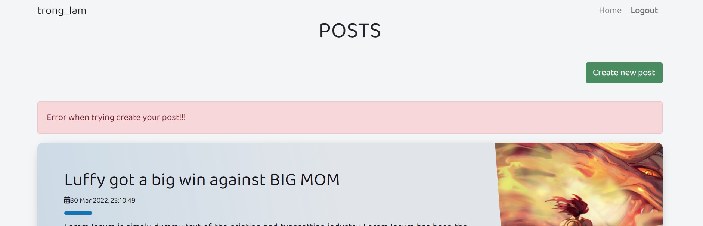
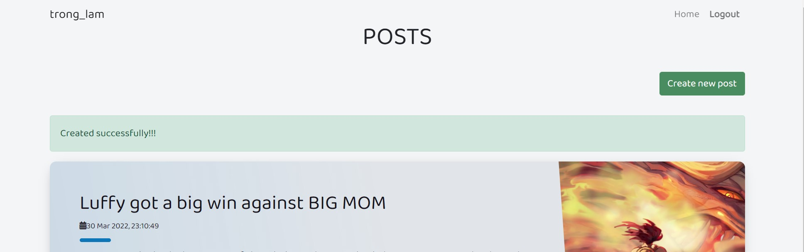

# Homework 3 developed by DBH
Clean looking posts page with login features
# Installation
Install dependencies
```
pip install -r requirements.txt
```
Run server
```
python app.py
```
Create `config.py` with these arguments:
```
USER_DB_DIR = 'database/logindb.txt'
IMAGES_ROOT = 'upload/'
SECRET_KEY = '<secret key>'
DATABASE_URI = '<your URI>'
UPLOAD_FOLDER = 'images'
ALLOWED_EXTENSIONS = {'png', 'jpg', 'jpeg', 'gif'}
```
# Tutorial
- `/login` - Login with your name and your password
- `/logout` - Logout from your account
- `/index` - View the posts
- `/create-post` - Create a new post for logined user
# Actions
-  Anyone can access the main page under anonymous user
# Web page review
- Login page:



- Anonymous main page view:



- Logined main page view:



- Create new post: 



- Created post fail:



- Created post successfully:

